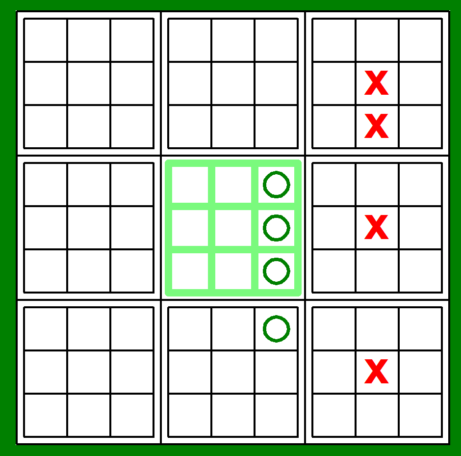

# BigTicTacToe

## Devalopment time
> 10.12.2023 ~ 12.18.2023

## Game rule
- When the game starts, the first player can place their pieces anywhere.

- The next player places his pieces wherever he wants on the board that corresponds to the location IN the small board chosen by the previous player.

- repeat the process

- If you place 3 pieces in a row on a small board, you own that board now and it gets marked with your colour, the other player gets to play anywhere they want.

- If the next location is owned by someone (including yourself), you get to place the piece anywhere you want.

- If a player owns 3 boards in a row, the game ends with that player winning.

## Code

### Vital functions

#### create_board
- literally creating a board
- resetting all the variables, lists and pieces

#### piece
- Calculating where was the exact cell the player clicked and placing their piece if the cell is available

#### win_check
- checking if the small game is won by someone

#### win
- checking if the big game is won by someone
